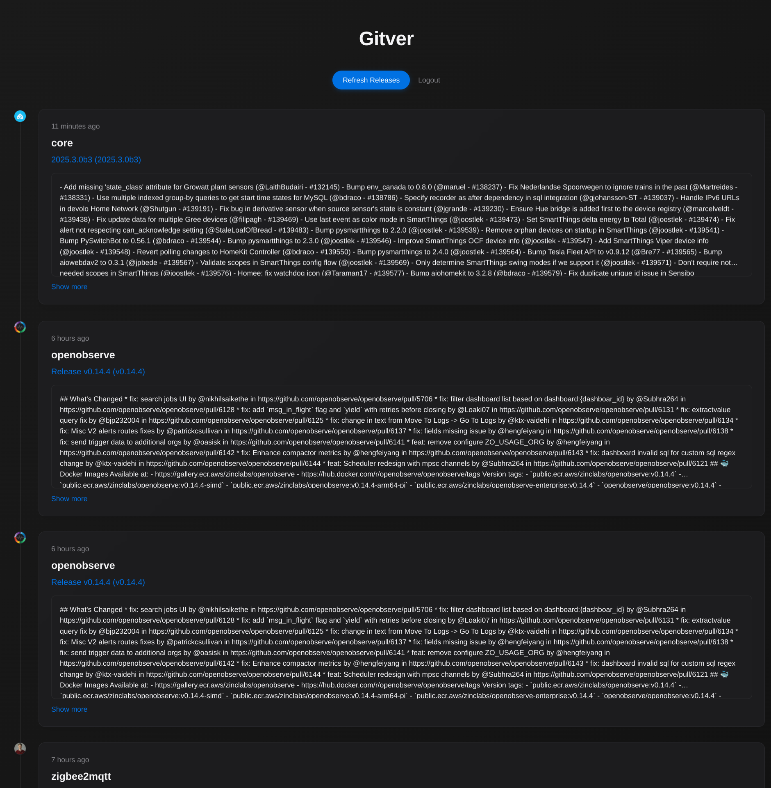

# GitVer
### List latest releases from your stared repositories


Build with Go + htmx

## Instalation
### Docker:

Build image:

```
docker build -t gitvergo .
```
Run docker:
```
docker run -d \
  --name gitver \
  --restart always \
  -p 4321:8080 \
  -e GITHUB_API_KEY=<API_KEY> \
  -e APP_USER=admin \
  -e APP_PASSWORD=password \
  gitvergo:latest
```

or via docker compose:

Create `.env` file with

```
GITHUB_API_KEY=<API_KEY>
APP_USER=admin
APP_PASSWORD=password
```

```
docker compose up -d
```